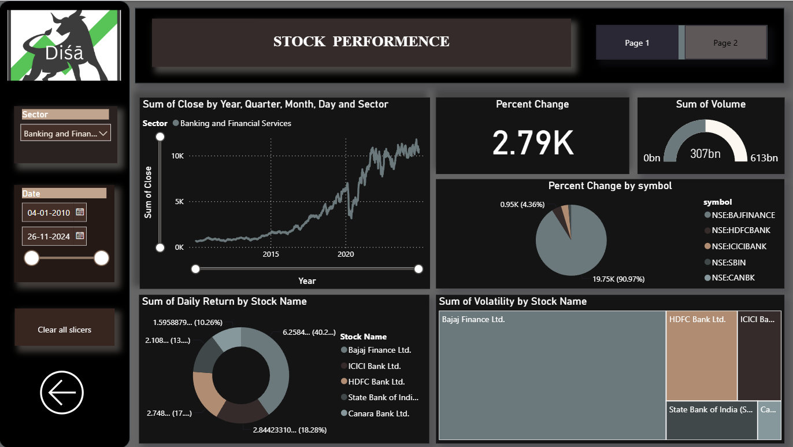
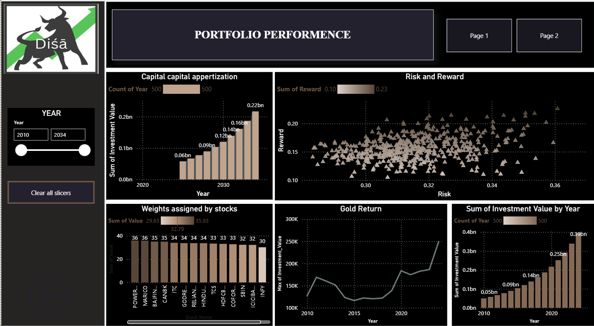

# 📈 Machine Learning-Driven Portfolio Optimization for the Indian Stock Market

<p align="center">


</p>

---

## 📌 Overview

This project presents an end-to-end **Machine Learning-based Portfolio Optimization System** for the Indian stock market.

Historical stock market data from multiple sectors is analyzed using feature engineering and regression models to estimate future returns. These predicted returns are then used with **Modern Portfolio Theory (Markowitz Optimization)** to construct an optimal portfolio that maximizes expected return while minimizing investment risk.

The project also includes an **interactive Power BI dashboard** for portfolio analytics and stock market visualization.

---

## 🎯 Objectives

- Predict future stock returns using Machine Learning
- Compare multiple regression algorithms
- Optimize stock allocation using Markowitz Portfolio Optimization
- Maximize Sharpe Ratio
- Analyze portfolio performance through interactive dashboards
- Forecast long-term investment growth

---

# 🚀 Features

- 📈 Machine Learning-Based Return Prediction
- 📊 Portfolio Optimization using Markowitz Theory
- 📉 Risk vs Reward Analysis
- 📌 Sharpe Ratio Optimization
- 📊 Interactive Power BI Dashboard
- 📈 Investment Growth Forecast
- 📂 Historical Indian Stock Market Dataset
- 📉 Technical Indicator Analysis

---

# 🏗️ Project Workflow

```text
Historical Stock Data
          │
          ▼
Data Preprocessing
          │
          ▼
Feature Engineering
          │
          ▼
Regression Models
(LightGBM | XGBoost | ElasticNet | Decision Tree)
          │
          ▼
Return Prediction
          │
          ▼
Markowitz Portfolio Optimization
          │
          ▼
Optimal Portfolio Selection
          │
          ▼
Power BI Dashboard
```

---

# 📂 Repository Structure

```text
ML-Driven-Portfolio-Optimization/
│
├── README.md
├── requirements.txt
├── .gitignore
│
├── data/
│   └── combined_mid_large_with_sectors.xlsx
│
├── notebooks/
│   └── Dv_3_split_model.ipynb
│
├── dashboard/
│   ├── Portfolio_Optimization_Dashboard.pbix
│   ├── stock-performance.png
│   └── portfolio-performance.png
│

```

---

# 📊 Dataset

The project uses historical stock market data covering **Indian Large-Cap and Mid-Cap companies** from multiple sectors.

### Dataset

```
combined_mid_large_with_sectors.xlsx
```

### Included Sectors

- Banking
- Information Technology
- FMCG
- Energy

### Features

- Date
- Symbol
- Stock Name
- Sector
- Open
- High
- Low
- Close
- Volume

### Engineered Technical Indicators

- RSI
- MACD
- ADX
- SMA
- EMA
- Bollinger Bands
- ATR
- Momentum
- Volatility
- OBV
- Daily Return
- Lagged Return

---

# 🧠 Machine Learning Models

The following regression algorithms were evaluated:

| Model | Purpose |
|---------|-----------------------------|
| LightGBM Regressor | Stock Return Prediction |
| XGBoost Regressor | Stock Return Prediction |
| ElasticNet Regression | Stock Return Prediction |
| Decision Tree Regressor | Stock Return Prediction |

The best-performing model for each stock was selected based on prediction accuracy.

---

# 📈 Portfolio Optimization

Predicted returns are passed to the **Markowitz Portfolio Optimization Model** to determine the optimal allocation of assets.

Optimization goals include:

- Maximum Expected Return
- Minimum Portfolio Risk
- Maximum Sharpe Ratio

---

# 📊 Dashboard

The repository includes an interactive **Power BI Dashboard**.

---

## 📄 Dashboard 1 — Stock Performance

### Insights

- Sector-wise Analysis
- Closing Price Trend
- Daily Returns
- Trading Volume
- Percentage Change
- Volatility Comparison



---

## 📄 Dashboard 2 — Portfolio Performance

### Insights

- Portfolio Investment Growth
- Risk vs Reward Analysis
- Optimal Asset Allocation
- Gold Return Comparison
- Investment Value by Year



---

# 📈 Key Results

✔ Machine Learning models successfully predicted stock returns.

✔ Portfolio optimized using Markowitz Optimization.

✔ Maximum Sharpe Ratio achieved.

✔ CAGR of approximately **33.9%**.

✔ Strong balance between expected return and investment risk.

---

# 🛠 Technologies Used

- Python
- Pandas
- NumPy
- Scikit-Learn
- LightGBM
- XGBoost
- Matplotlib
- Plotly
- Power BI
- Jupyter Notebook

---

# ⚙ Installation

Clone the repository

```bash
git clone https://github.com/YOUR_USERNAME/ML-Driven-Portfolio-Optimization.git
```

Navigate to the project

```bash
cd ML-Driven-Portfolio-Optimization
```

Install dependencies

```bash
pip install -r requirements.txt
```

Launch Jupyter Notebook

```bash
jupyter notebook
```

Open

```
Dv_3_split_model.ipynb
```

---

# 📁 Files Included

| File | Description |
|------|-------------|
| `Dv_3_split_model.ipynb` | Complete Machine Learning implementation |
| `combined_mid_large_with_sectors.xlsx` | Historical stock dataset |
| `Portfolio_Optimization_Dashboard.pbix` | Interactive Power BI Dashboard |
| `Research_Paper.pdf` | Research paper |

---


# 🔮 Future Work

- Deep Learning Models (LSTM, GRU, Transformer)
- Real-Time Stock Prediction
- Live NSE/BSE Data Integration
- Automated Portfolio Rebalancing
- Explainable AI for Investment Decisions
- Web-Based Portfolio Recommendation System

---

# 👩‍💻 Author

**Siva Jyothis**

M.Tech in Data Science

Amrita Vishwa Vidyapeetham, Bengaluru

---

# ⭐ Support

If you found this project helpful, please consider giving it a ⭐ on GitHub.